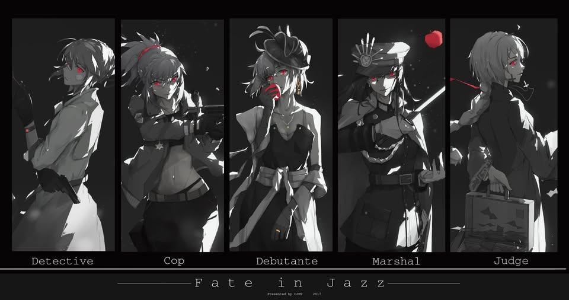
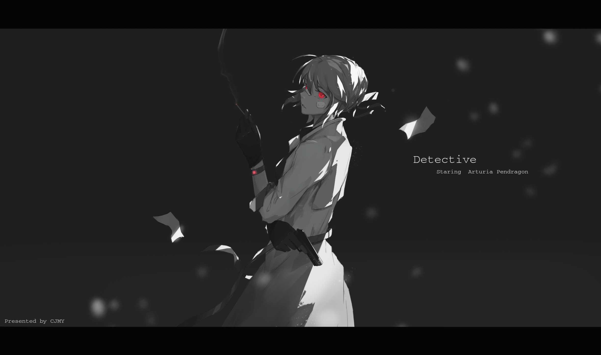

<p align="center">
  
</p>

<h1 align="center">Hey there, I'm Zec</h1>

<p align="center">
  
</p>

<p align="center">
  
  
  
  
</p>

---

<div>

<br/>


```diff
+ 22 years old · BSIT 4th year · coding since 6th grade
+ I automate daily tasks so life stays fast, efficient, and interesting
+ Former Minecraft client dev · React · ML · databases · cyber awareness · Python
```

I've been coding since **6th grade**. I spent **2+ years** building Minecraft clients with JavaScript on my channel [**XinderModz**](https://www.youtube.com/@XinderModz), constantly improving every day.

College pushed me further by understanding databases, frameworks, new languages, clean data workflows, Access-based software, **React**, **machine learning** (Markov chains), **AI**, and **cyber awareness**.

What intrigues me most? **Automation.** I love turning repetitive work into code so I can focus on harder problems. I call it being **productively lazy** not avoiding work, but engineering smarter ways to get things done.

</div>

---

## Languages & Tools

<p align="left">
  <a href="https://www.w3schools.com/css/" target="_blank" rel="noreferrer">
    
  </a>
  <a href="https://www.w3.org/html/" target="_blank" rel="noreferrer">
    
  </a>
  <a href="https://developer.mozilla.org/en-US/docs/Web/JavaScript" target="_blank" rel="noreferrer">
    
  </a>
  <a href="https://www.python.org/" target="_blank" rel="noreferrer">
    
  </a>
  <a href="https://www.mongodb.com/" target="_blank" rel="noreferrer">
    
  </a>
  <a href="https://unity.com/" target="_blank" rel="noreferrer">
    
  </a>
</p>

<p align="left">
  
  
  
  
  
  
</p>

---

## What I'm Learning

| Skill | Experience |
| :--- | :--- |
| **JavaScript** | 3 years |
| **Java** | 3 years |
| **Python** | 5 years |
| **React** | 1 year |
| **Automation & AI** | Always exploring |

---

<div>
<table>
<tr>
<td valign="top" width="65%">

<h3>Repository</h3>
<br/>

- [***Zectxr/discord-token-checker***](https://github.com/Zectxr/discord-token-checker) <br/>
  A modern React web app to verify Discord tokens and view detailed account information
- [***Zectxr/Xyphra***](https://github.com/Zectxr/Xyphra) <br/>
  A lightweight web tool to scan URLs and files for potential security threats

<br/>

<br/>

<sub>*"Being productively lazy isn't avoiding work — it's engineering smarter ways to get things done." — Zec*</sub>

</td>
<td valign="middle" width="35%" align="right">


</td>
</tr>
</table>
</div>

---

## Experience

> **4th Year** — Bachelor of Science in Information Technology

---

## Reach Me

<p align="left">
  <a href="https://twitter.com/ZecTorPlayer" target="_blank">
    
  </a>
  <a href="https://www.youtube.com/@XinderModz" target="_blank">
    
  </a>
  
</p>

<p align="center">
  
</p>

---

<p align="center">
  <i>Building automations. Learning daily. Making hard things easy.</i>
</p>
